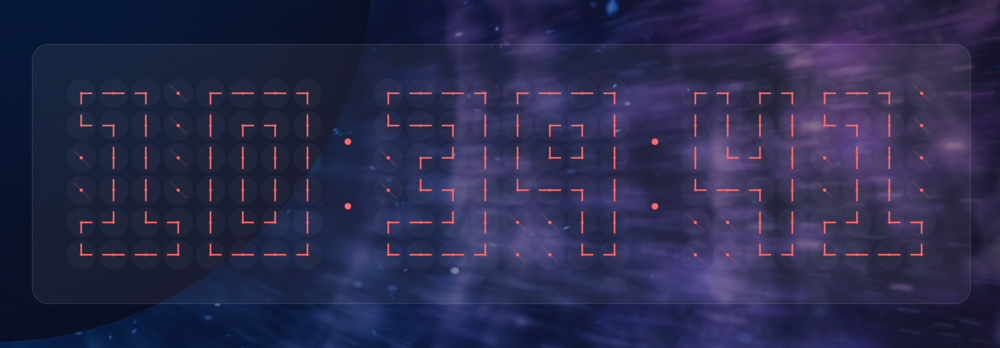

# Chronomatrix

A unique digital clock where each digit is composed of a 6x4 grid of
analog clocks. The clock hands on each mini analog clock are positioned
to form the shape of the digit.



## Features

- **Creative Display**: Each digit (0-9) is rendered using 24 individual
  analog clocks
- **Smooth Animations**: Clock hands rotate smoothly (clockwise) when
  digits change, with configurable animation duration and color
  transitions
- **Hot-Reload Configuration**: Changes to config file are automatically
  applied without restart
- **Highly Configurable**: Customize colors, sizes, gaps, animation
  speed via TOML config
- **Graceful Defaults**: Override only the settings you want, defaults
  fill in the rest
- **Background Opacity**: Adjustable window background opacity (affects
  only background, not clock hands)
- **No Title Bar**: Clean, minimal window decoration
- **Live Updates**: Clock updates every second

## Development

### Code Quality

The project includes tools to maintain code quality:

```bash
# Run all pre-commit checks (format, lint, build)
make precommit

# Individual checks
make fmt      # Format code with cargo fmt
make clippy   # Run clippy linter
make build    # Build release version

# See all available commands
make help
```

A git pre-commit hook is automatically installed that runs these checks
before each commit. If checks fail, the commit will be rejected.

## Building

### Requirements

- Rust 1.82+ (edition 2024)
- GTK4 development libraries
- libadwaita development libraries
- Cairo development libraries
- pkg-config

### Debian/Ubuntu

```bash
sudo apt install libgtk-4-dev libadwaita-1-dev libcairo2-dev pkg-config
cargo build --release
cargo run --release
```

### Fedora

```bash
sudo dnf install gtk4-devel libadwaita-devel cairo-devel pkg-config
cargo build --release
cargo run --release
```

### Arch Linux

```bash
sudo pacman -S gtk4 libadwaita cairo pkgconf
cargo build --release
cargo run --release
```

### Nix

```bash
# Run directly from GitHub without cloning
nix run github:jcowgar/chronomatrix

# Or clone and run locally
git clone https://github.com/jcowgar/chronomatrix
cd chronomatrix
nix run .

# Or enter development shell and build manually
nix develop
cargo build --release
cargo run --release
```

## Configuration

### Location

The application reads its configuration from:

- `~/.config/chronomatrix/config.toml`

### Hot-Reload

Configuration changes are automatically detected and applied in
real-time. Simply edit and save your config file - no restart required.

### Graceful Defaults

All configuration settings are optional. You only need to specify what
you want to customize - everything else will use sensible defaults. An
empty config file (or no config file at all) will work perfectly fine.

### Color Format

All colors use hex format and support alpha transparency:

- `#RRGGBB` - RGB color (e.g., `#ff6b6b`)
- `#RRGGBBAA` - RGB with alpha channel (e.g., `#ff6b6b26` for 15%
  opacity)

### Configuration Reference

#### `[colors]` Section

Controls all visual colors in the application.

| Setting               | Type  | Default     | Description                                          |
| --------------------- | ----- | ----------- | ---------------------------------------------------- |
| `window_background`   | Color | `#0f0c29`   | Window background color                              |
| `clock_hand_color`    | Color | `#ff6b6b`   | Color of active clock hands (hands that form digits) |
| `clock_hand_inactive` | Color | `#ff6b6b26` | Color of inactive clock hands (background clocks)    |
| `clock_bg`            | Color | `#ffffff08` | Background fill of individual clock faces            |
| `clock_border`        | Color | `#ffffff1a` | Border color of individual clock faces               |
| `display_bg`          | Color | `#ffffff0d` | Background of the display container                  |
| `display_border`      | Color | `#ffffff1a` | Border of the display container                      |
| `separator_color`     | Color | `#ff6b6b`   | Color of the `:` separator dots between digits       |

#### `[window]` Section

Controls window behavior and appearance.

| Setting   | Type  | Default | Description                                                                                                                                    |
| --------- | ----- | ------- | ---------------------------------------------------------------------------------------------------------------------------------------------- |
| `opacity` | Float | `1.0`   | Window background opacity (0.0 = fully transparent, 1.0 = fully opaque). Only affects the background - clock hands and UI remain fully opaque. |

#### `[clock]` Section

Controls the size and behavior of the analog clocks.

| Setting                 | Type    | Default | Description                                          |
| ----------------------- | ------- | ------- | ---------------------------------------------------- |
| `size`                  | Integer | `40`    | Size of each individual analog clock in pixels       |
| `stroke_width`          | Float   | `2.0`   | Width of clock hands in pixels                       |
| `clock_gap`             | Integer | `1`     | Gap between individual clocks in pixels              |
| `digit_gap`             | Integer | `8`     | Gap between digit sections (between HH, MM, and SS)  |
| `animation_duration_ms` | Integer | `300`   | Duration of hand rotation animations in milliseconds |

### Example Configuration

Here's a complete configuration file with all default values. Copy this
as a starting point and modify what you want:

```toml
[colors]
window_background = "#0f0c29"
clock_hand_color = "#ff6b6b"
clock_hand_inactive = "#ff6b6b26"
clock_bg = "#ffffff08"
clock_border = "#ffffff1a"
display_bg = "#ffffff0d"
display_border = "#ffffff1a"
separator_color = "#ff6b6b"

[window]
opacity = 1.0

[clock]
size = 40
stroke_width = 2.0
clock_gap = 1
digit_gap = 8
animation_duration_ms = 300
```

Remember: All settings are optional! You can include only the ones you
want to change.

## License

This project is licensed under the GNU General Public License v3.0 - see
the [LICENSE](LICENSE) file for details.
